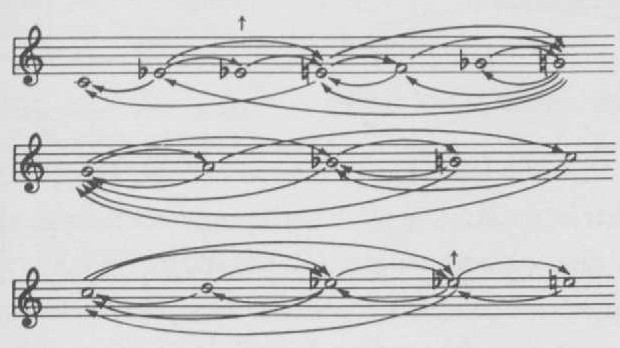

# Early Downhome Blues

An interactive web app for exploring the pitch network from Jeff Todd Titon's *Early Downhome Blues: A Musical and Cultural Analysis* (Figure 64).

**[Try it live](https://early-downhome-blues.vercel.app/)**

## About

This tool lets you walk through Titon's pitch transition network, which maps how melodies move between notes in early downhome blues. The network includes:

- **Quarter-tones**: The "blue third" (E quarter-flat) between E♭ and E
- **Sink note**: C4 is the only resolution point with no outgoing paths
- **Hub note**: G4 connects to the most destinations (6 notes)

## Features

- **Interactive notation**: Click notes directly on the staff to navigate
- **Paths display**: See all possible next notes from your current position
- **Pluck synth**: Guitar-like sound using Karplus-Strong synthesis
- **Inflecting drone**: Toggle drone notes (root, 3rd, 5th, 7th) that bend to match the melody's microtonal inflections
- **MIDI output**: Send notes to external instruments with pitch bend for quarter-tones (set pitch bend range to ±4 semitones)
- **Score view**: See your melody as notation; export to LilyPond, MusicXML, or PDF
- **Keyboard controls**: Play entirely from the keyboard (see below)

## Keyboard Shortcuts

### Melody
| Key | Action |
|-----|--------|
| **Space** | Next note |
| **Shift+Space** | Kill/silence melody note |
| **Backspace** | Undo last note |
| **Escape** | Clear score |

### Chords
| Key | Action |
|-----|--------|
| **1** | I chord |
| **2** | ii chord |
| **3** | iii chord |
| **Cmd/Ctrl+3** | ♭III chord |
| **4** | IV chord |
| **5** | V chord |
| **6** | vi chord |
| **7** | ♭VII chord |

### Toggles
| Key | Action |
|-----|--------|
| **M** | Toggle audio mute |
| **I** | Toggle inflection |
| **P** | Toggle phrasing |
| **Cmd/Ctrl+M** | Toggle extended chords |

## Quarter-tone Support

The app uses LilyPond notation internally:
- `ees'` = E♭ (E flat)
- `eeh'` = E quarter-flat (halfway between E♭ and E)
- `e'` = E natural

For MIDI, quarter-tones are achieved via pitch bend (50 cents up from the flat).

## Tech Stack

- [Tone.js](https://tonejs.github.io/) - Web Audio synthesis
- [VexFlow](https://www.vexflow.com/) - Music notation rendering
- Vanilla JavaScript

## Reference

Titon, Jeff Todd. *Early Downhome Blues: A Musical and Cultural Analysis*. 2nd ed., University of North Carolina Press, 1994.

## License

MIT
